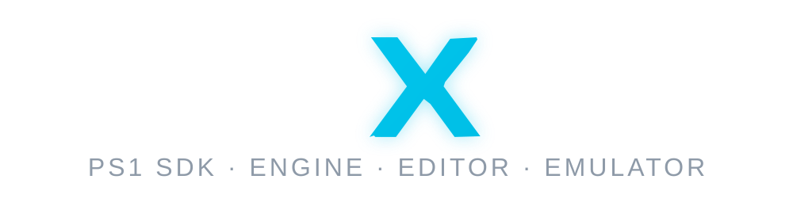

# PSoXide

<p align="center">
  
</p>

<p align="center">
  <a href="LICENSE"></a>
  
  
  <a href="https://bonnie-studios.itch.io/psoxide"></a>
</p>

**PSoXide is an open-source PlayStation 1 development stack written in Rust.**
It brings together an accuracy-focused **emulator** and debugger, a bare-metal
**SDK**, a runtime **engine**, an asset **editor**, and **disc tooling**. The
pipeline is designed to author content, cook PS1-ready assets, build CUE/BIN
disc images, and run them in emulators or on original hardware.

**Try it now:** the emulator runs in your browser on
[the itch.io page](https://bonnie-studios.itch.io/psoxide). Press play and the
PSoXide Demo Disc (ten homebrew programs, CD audio and all) streams in on
demand; the SDK and engine samples are baked in under **Examples**, so there
is something to run without supplying a disc. No install, no BIOS.

The primary reference project is a dark, third-person PS1 action-RPG vertical
slice. The public tools are built around proving the full workflow end to end.

| | |
| --- | --- |
|  |  |
|  |  |

> **Pre-release software.** The end-to-end pipeline works, but APIs, file
> formats, and editor workflows may still change. There are no native release
> binaries yet; build from source, or try the
> [web emulator](https://bonnie-studios.itch.io/psoxide) without installing
> anything. Project page:
> [bonnie-studios.itch.io/psoxide](https://bonnie-studios.itch.io/psoxide).

## Features

- **Emulator** - CPU, GTE, GPU, DMA, CD-ROM, SIO, timers, MDEC, and SPU, with an
  HLE BIOS path so homebrew needs no retail BIOS. Desktop frontend
  (winit/wgpu/egui) with debugger panels for registers, memory, VRAM, execution
  history, profiling, and savestates, plus a free camera that detaches the view
  from the game's own so geometry can be inspected while it runs.
- **SDK** - bare-metal Rust crates for the `mipsel-sony-psx` target: GPU, GTE,
  SPU, pad, fonts, DMA/ordering tables, and runtime.
- **Engine** - a Scene/App framework with a streamed room runtime (chunk
  residency, CD-sector packing, 60 Hz paced simulation), 3D with hardware
  lighting and fog, particles, and CD-DA.
- **Editor** - project model, 2D/3D viewports, room-grid authoring, asset
  cooking (`psxed`), and one-click **Play** that cooks, builds, boots a disc, and
  shows the live framebuffer in the viewport.
- **Disc tooling** - CUE/BIN builders and headless export of an authored project
  to a bootable image.
- **Agent control** - an optional MCP server embedded in the running frontend,
  so a coding agent can boot a disc, step it frame by frame, and read RAM and
  VRAM while it runs (see [Agent control (MCP)](#agent-control-mcp)).

Per-crate detail lives in each area's README (see [Repository
layout](#repository-layout)).

## Status

The project can currently author a project in the editor, cook assets, build a
PS1 disc image, and boot that image. The emulator implements the main PS1
subsystems (CPU, GTE, GPU, DMA, CD-ROM with XA-ADPCM and CD-DA, SIO, timers,
MDEC, interrupts, SPU, and memory cards), and the SDK/engine examples build into
bootable homebrew discs.

Known gaps:

- Broad commercial-game compatibility is incomplete; timing drift and long-tail
  peripheral behaviour are active research, tracked per game.
- Peripherals cover the digital/analog pad and memory cards only (no multitap,
  mouse, or light-gun).
- A few deliberate emulator simplifications: no instruction-cache model, and some
  rarely-used GPU/DMA/timer edge cases favour parity over silicon-exactness.
- The editor is usable but pre-1.0 (import UX, project templates, undo depth, and
  packaging still need work).
- No published release binaries, and the public CI currently gates dependency
  policy only, with build/test/lint advisory.

## Real-hardware accuracy

PSoXide uses real-console validation where it matters most:

- **GTE: bit-for-bit** against JaCzekanski's real-console `ps1-tests` corpus
  (1100/1100 across all opcodes and registers), with the software GTE also
  covered by an extensive in-tree unit-test suite.
- **Triangle rasterizer matches silicon** - center-sampled coverage confirmed by
  VRAM read-back photographed on hardware, after the original reference edge rule
  was proven wrong on the console.
- **Silicon-measured GTE hazards** are modeled, including the 2-instruction GTE
  load delay and a mid-MVMVA register commit case that reproduces a real
  skinned-mesh corruption bit-for-bit.

Hardware findings are converted into regression tests or validation tools when
they become part of the public engineering surface.

## Quick start

You need the nightly Rust toolchain pinned by `rust-toolchain.toml`. On macOS
and Linux, the top-level `Makefile` is the easiest way to build and run the
project. On Windows, install the MSVC toolchain and use Cargo directly for host
builds; the Makefile targets assume a Unix-like shell.

```bash
git clone https://github.com/EBonura/PSoXide.git psoxide
cd psoxide
make check && make test                # build + fast tests (no BIOS or games needed)

make hello-tri-disc && make run-tri    # build a homebrew example and boot it
make run                               # launch with fast incremental dev builds
make run-release                       # launch the fully optimised build
```

Open the editor from the frontend's **Create** menu, then hit **Play** to cook,
build, and boot the active project live in the viewport.

For deterministic editor UI validation, render the complete editor through its
headless offscreen path. This opens no native window, so another PSoXide
process, desktop focus, notifications, and Spaces cannot affect the capture:

```bash
make editor-ui-screenshot \
  EDITOR_UI_PROJECT=editor/samples/cortex_v1 \
  EDITOR_UI_VIEW=animation \
  EDITOR_UI_RESOURCE='Stand To Roll' \
  EDITOR_UI_FRAME_SELECTED=1 \
  EDITOR_UI_OUT=/tmp/psoxide-animation.png
```

The equivalent frontend command is `dump-editor-ui`; it accepts explicit
dimensions and can inject the `.` frame-selected shortcut before capture.

<details>
<summary><strong>Platform prerequisites</strong></summary>

**macOS**
```bash
xcode-select --install
curl --proto '=https' --tlsv1.2 -sSf https://sh.rustup.rs | sh
```

**Debian / Ubuntu** (native libraries for the desktop frontend)
```bash
sudo apt install build-essential make pkg-config libasound2-dev libudev-dev \
  libx11-dev libxi-dev libxrandr-dev libxinerama-dev libxcursor-dev \
  libxkbcommon-dev libwayland-dev mesa-vulkan-drivers
```

**Windows** (MSVC host; `make` is optional, use `cargo` directly)
```powershell
winget install Rustlang.Rustup
winget install Microsoft.VisualStudio.2022.BuildTools --override "--add Microsoft.VisualStudio.Workload.VCTools --includeRecommended --passive --wait"
rustup show
cargo check --workspace --all-features
cargo run -p frontend
```

The pinned nightly installs `rustfmt`, `clippy`, `rust-src`, and `llvm-tools`
automatically. The bare-metal PSX target builds via `-Zbuild-std` + `rust-src`
(there is no prebuilt standard library for it).
</details>

<details>
<summary><strong>Free camera</strong></summary>

Detaches the view from the game's own camera so geometry, culling, and framing
can be inspected while the game keeps running.

| | |
| --- | --- |
| Toggle | Toolbar **EYE** button, or **tap L3+R3** on a pad |
| Move / look | Left stick moves, right stick looks, **R2** boosts |
| Reset | **Hold L3+R3** to put the camera back at the game's viewpoint |

Switching modes keeps the camera where it is, so you can glance back at the game
and return to the shot you had lined up. While the free camera is engaged the
guest sees a neutral controller: nothing you press reaches the game, which is
why a standing **FREECAM** badge is shown.
</details>

<details>
<summary><strong>Using a retail BIOS</strong> (optional)</summary>

Homebrew examples and editor Play use the HLE BIOS path and need no BIOS. A real
BIOS is only required for retail-disc boot and the BIOS canaries. Dump your own,
then set it in the frontend (**Menu → Choose BIOS path**) or via
`export PSOXIDE_BIOS=/path/to/SCPH1001.BIN`. Only use BIOS and game images you
legally own.
</details>

<details>
<summary><strong>Common make targets</strong></summary>

```bash
make check / test / fmt / lint    # quality gates
make examples                     # build every SDK/engine/game example disc
make <name>-disc / run-<name>     # build / boot one example
make validate                     # exact-hash display/VRAM regression matrix
```

The `Makefile` is the source of truth on Unix-like hosts; the per-area READMEs
cover everything else.
</details>

## Agent control (MCP)

The frontend can host an [MCP](https://modelcontextprotocol.io) server, built on
the official `rmcp` SDK, so an agent drives the same emulator you are looking at
rather than a headless copy of it. A screenshot is what the GPU just produced,
and a RAM read is the state behind it.

It is opt-in and native-only:

```bash
cargo run -p frontend --features mcp
```

The server starts with the GUI and serves streamable HTTP at `/mcp` on
`127.0.0.1:7355`. Set `PSOXIDE_MCP_PORT` to move it. If the port cannot be
bound the GUI still runs without it.

Point your client at `http://127.0.0.1:7355/mcp`. The tools are:

| Tool | Purpose |
| --- | --- |
| `load_game`, `reset` | boot a `.cue`/`.bin`/`.iso`/`.ccd` or PSX-EXE, reboot it |
| `pause`, `resume`, `step` | stop, run, or advance N video frames while paused |
| `screenshot`, `dump_vram` | PNG of the display output, PNG of all 1024x512 VRAM |
| `read_ram`, `read_word`, `write_ram` | inspect and poke main RAM |
| `toggle_wireframe`, `status` | render mode, and run state / PC / cycles / display |

`step` works while paused, which is what makes a deterministic loop possible:
pause, step a known number of frames, screenshot, compare.

## Provenance and licensing

PSoXide is developed with substantial AI assistance, with a human directing the
architecture, debugging, and hardware verification. This is disclosed openly and
is **not** a clean-room claim.

It is licensed **GPL-2.0-or-later**, and that is *required*, not stylistic. PSoXide
leaned heavily on **PCSX-Redux** (GPL-2.0-or-later) early on and has since diverged
substantially, with many subsystems rewritten from hardware documentation and
silicon testing. The parts that remain derived from PCSX-Redux are individually
marked with per-file `## Provenance` headers, and the GPL is what that remaining
derivation obliges; subsystems written from hardware docs and only parity-checked
say so explicitly. Your own game content - art, models, levels, music - stays yours.

If you plan to build and **distribute** on top of PSoXide, start with
**[`docs/downstream-licensing.md`](docs/downstream-licensing.md)**. Full detail:
[`LICENSE`](LICENSE), [`docs/license-audit.md`](docs/license-audit.md), and
[`docs/asset-provenance.md`](docs/asset-provenance.md).

## Repository layout

| Area | What's inside |
| --- | --- |
| [`emu/`](emu/README.md) | Emulator core, desktop frontend, renderer, validation. |
| [`sdk/`](sdk/README.md) | Bare-metal PSX SDK crates and `hello-*` examples. |
| [`engine/`](engine/README.md) | Scene/App runtime engine, level schema, example games. |
| [`editor/`](editor/README.md) | Project model, asset cookers, and editor UI. |
| [`crates/`](crates/README.md) | Shared `no_std` PSX primitives. |
| [`tools/`](tools/README.md) | Disc-mastering and EXE utilities. |
| [`docs/`](docs/README.md) | Architecture, hardware reference, and planning notes. |

## Examples

The repo ships runnable examples that double as the SDK/engine test suite:
`hello-*` bare-metal SDK demos, 3D / lighting / fog / particle showcases, and
small games (Pong, Breakout, Space Invaders). Build them all with
`make examples`; descriptions are in the [`sdk/`](sdk/README.md) and
[`engine/`](engine/README.md) READMEs.

They are also baked into the emulator itself, under **Examples** in the menu, so
the [web build](https://bonnie-studios.itch.io/psoxide) and a binary with no source
tree beside it both have something to run without supplying a disc.

|  |  |  |
| --- | --- | --- |

## License

**GPL-2.0-or-later** (see [`LICENSE`](LICENSE)). Commercial homebrew is fine: you
can sell games built with PSoXide; the GPL only requires that the covered code
you distribute stays GPL-compatible, and your original assets remain yours. The
details, and what this means for projects built on top, are in
[Provenance and licensing](#provenance-and-licensing) and
[`docs/downstream-licensing.md`](docs/downstream-licensing.md).
